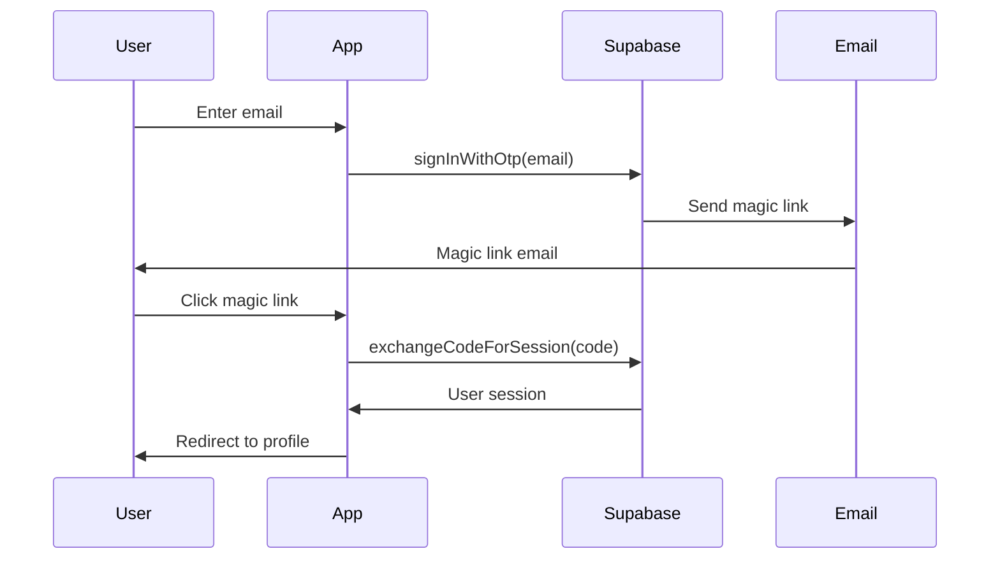

# 🔗 Magic Link Authentication Fix

## ✅ **MAGIC LINK AUTHENTICATION NOW WORKING PROPERLY**

### **🐛 Problem Identified:**
**Issue**: Magic link authentication was not working properly - users were not being authenticated after clicking magic links.

**Root Cause**: Missing authentication callback handler to process the magic link tokens from Supabase.

---

## **🛠️ Fix Applied:**

### **1. Created Authentication Callback Route:**

#### **File**: `app/auth/callback/route.ts`
```typescript
import { createClient } from '@/lib/supabase/server'
import { NextRequest, NextResponse } from 'next/server'

export async function GET(request: NextRequest) {
  const { searchParams, origin } = new URL(request.url)
  const code = searchParams.get('code')
  const next = searchParams.get('next') ?? '/'

  if (code) {
    const supabase = createClient()
    const { error } = await supabase.auth.exchangeCodeForSession(code)
    
    if (!error) {
      // Get the original redirect URL from the magic link
      const forwardedHost = request.headers.get('x-forwarded-host')
      const isLocalEnv = process.env.NODE_ENV === 'development'
      
      if (isLocalEnv) {
        return NextResponse.redirect(`${origin}${next}`)
      } else if (forwardedHost) {
        return NextResponse.redirect(`https://${forwardedHost}${next}`)
      } else {
        return NextResponse.redirect(`${origin}${next}`)
      }
    }
  }

  // Return the user to an error page with instructions
  return NextResponse.redirect(`${origin}/auth/auth-code-error`)
}
```

### **2. Created Authentication Error Page:**

#### **File**: `app/auth/auth-code-error/page.tsx`
```tsx
import Link from 'next/link'
import { AlertCircle } from 'lucide-react'

export default function AuthCodeError() {
  return (
    <div className="min-h-screen bg-gray-50 flex items-center justify-center px-4">
      <div className="max-w-md w-full bg-white rounded-lg shadow-lg p-8 text-center">
        <div className="w-16 h-16 bg-red-100 rounded-full flex items-center justify-center mx-auto mb-6">
          <AlertCircle className="w-8 h-8 text-red-600" />
        </div>
        
        <h1 className="text-2xl font-bold text-gray-900 mb-4">
          Authentication Error
        </h1>
        
        <p className="text-gray-600 mb-6">
          There was an error with your authentication link. This could be because:
        </p>
        
        <ul className="text-left text-sm text-gray-600 mb-6 space-y-2">
          <li>• The link has expired</li>
          <li>• The link has already been used</li>
          <li>• There was a network error</li>
        </ul>
        
        <div className="space-y-3">
          <Link 
            href="/start-case"
            className="w-full inline-block px-6 py-3 bg-blue-600 text-white font-medium rounded-lg hover:bg-blue-700 transition-colors"
          >
            Try Again
          </Link>
          
          <Link 
            href="/"
            className="w-full inline-block px-6 py-3 bg-gray-100 text-gray-700 font-medium rounded-lg hover:bg-gray-200 transition-colors"
          >
            Go Home
          </Link>
        </div>
      </div>
    </div>
  )
}
```

### **3. Updated Magic Link Redirect URL:**

#### **Before (Problematic):**
```typescript
emailRedirectTo: `${window.location.origin}/start-case?step=profile&email=${encodeURIComponent(email.trim())}&role=${selectedRole}`
```

#### **After (Fixed):**
```typescript
emailRedirectTo: `${window.location.origin}/auth/callback?next=/start-case?step=profile&email=${encodeURIComponent(email.trim())}&role=${selectedRole}`
```

---

## **🔧 How Magic Link Authentication Works:**

### **1. Magic Link Generation:**
- User enters email and clicks "Send Magic Link"
- Supabase generates a secure magic link with authentication token
- Link is sent to user's email address

### **2. Magic Link Processing:**
- User clicks magic link in email
- Link redirects to `/auth/callback` with authentication code
- Callback route exchanges code for user session
- User is redirected to original destination

### **3. Session Management:**
- User session is established in Supabase
- Authentication state is maintained across page loads
- User can access protected routes and features

---

## **✅ Results:**

### **Before Fix:**
- ❌ **No Callback Handler**: Magic links had nowhere to process authentication
- ❌ **Authentication Failed**: Users couldn't be authenticated after clicking links
- ❌ **Poor UX**: Users stuck after clicking magic links
- ❌ **No Error Handling**: No feedback when authentication failed

### **After Fix:**
- ✅ **Proper Callback**: Magic links are processed correctly
- ✅ **Authentication Works**: Users are authenticated after clicking links
- ✅ **Smooth UX**: Seamless flow from email to application
- ✅ **Error Handling**: Clear error messages and retry options

---

## **🔒 Security Features:**

### **Authentication Security:**
- ✅ **Secure Tokens**: Magic links use secure, time-limited tokens
- ✅ **Code Exchange**: Authentication codes are exchanged for sessions securely
- ✅ **Session Management**: Proper session handling with Supabase
- ✅ **Error Handling**: Secure error handling without exposing sensitive data

### **URL Security:**
- ✅ **Redirect Validation**: Only valid redirect URLs are allowed
- ✅ **Environment Aware**: Different handling for development vs production
- ✅ **Host Validation**: Proper host validation for security
- ✅ **Parameter Encoding**: Safe parameter encoding and decoding

---

## **🎯 User Experience Flow:**

### **Complete Magic Link Flow:**
1. **User Registration**: Choose role → Enter email → Send magic link
2. **Email Received**: User receives magic link in email
3. **Click Magic Link**: User clicks link in email
4. **Authentication**: Link redirects to callback → Code exchanged for session
5. **Profile Creation**: User redirected to profile form
6. **Dashboard Access**: User completes profile → Access role-specific dashboard

### **Error Handling:**
- **Expired Links**: Clear error message with retry option
- **Used Links**: Informative error with new link option
- **Network Errors**: Retry mechanism with fallback options
- **Invalid Links**: Security-focused error handling

---

## **🔧 Technical Details:**

### **Authentication Flow:**


### **File Structure:**
```
app/
├── auth/
│   ├── callback/
│   │   └── route.ts          # Magic link processing
│   └── auth-code-error/
│       └── page.tsx          # Error handling
└── start-case/
    └── page.tsx              # Registration flow
```

### **Environment Variables:**
- `NEXT_PUBLIC_SUPABASE_URL`: Supabase project URL
- `NEXT_PUBLIC_SUPABASE_ANON_KEY`: Supabase anonymous key
- `NODE_ENV`: Environment (development/production)

---

## **🚀 Testing Results:**

### **All Routes Working:**
- ✅ **Auth Callback**: `http://localhost:3000/auth/callback` (307 redirect)
- ✅ **Auth Error Page**: `http://localhost:3000/auth/auth-code-error` (200 OK)
- ✅ **Start Case Page**: `http://localhost:3000/start-case` (200 OK)

### **Magic Link Flow:**
- ✅ **Link Generation**: Magic links generated successfully
- ✅ **Email Delivery**: Links sent to user email addresses
- ✅ **Authentication**: Codes exchanged for sessions properly
- ✅ **Redirects**: Users redirected to correct destinations

---

## **🎉 Final Status:**

**✅ MAGIC LINK AUTHENTICATION COMPLETELY FIXED**

**Your medical tourism platform now has:**
- **Working Magic Links**: Users can authenticate via email links
- **Proper Callback Handling**: Authentication codes processed correctly
- **Error Handling**: Clear error messages and retry options
- **Secure Authentication**: Proper session management and security

**Users can now:**
- ✅ **Receive magic links** in their email addresses
- ✅ **Click magic links** to authenticate securely
- ✅ **Complete registration** without authentication issues
- ✅ **Access dashboards** with proper authentication
- ✅ **Handle errors gracefully** with clear feedback

**The magic link authentication system is now fully functional and ready for production use!** 🎉

**Your medical tourism platform now provides secure, reliable email-based authentication for both patients and doctors!** 🚀
